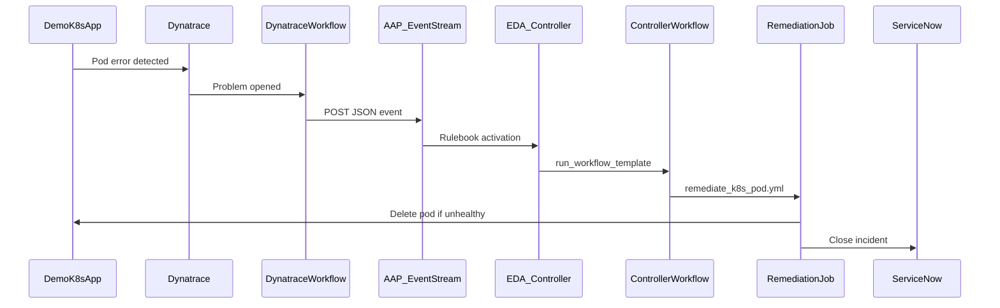

# Event-Driven Ansible: Dynatrace → Pod Restart → ServiceNow

Demo repository for **Event-Driven Ansible (EDA)** on Ansible Automation Platform 2.6+: Dynatrace detects an unhealthy Kubernetes pod, sends an event through an **Event Stream**, EDA launches an **Automation Controller workflow** that deletes the pod so the workload controller recreates it, then **closes the correlated ServiceNow incident**.

## Architecture



## Prerequisites

- Ansible Automation Platform **2.6+** with EDA and Event Streams
- Dynatrace with **Workflows** and [Red Hat Ansible for Workflows](https://docs.dynatrace.com/docs/analyze-explore-automate/workflows/default-workflow-actions/actions/red-hat/redhat-even-driven-ansible)
- Kubernetes cluster and credentials for pod delete
- ServiceNow instance and credentials for incident close

## Repository layout

| Path | Description |
|------|-------------|
| [`rulebooks/k8s_pod_remediation.yml`](rulebooks/k8s_pod_remediation.yml) | EDA rulebook → `run_workflow_template` on Controller |
| [`playbooks/remediate_k8s_pod.yml`](playbooks/remediate_k8s_pod.yml) | Restart pod + close incident (Controller job template playbook) |
| [`docs/aap-controller-workflow.md`](docs/aap-controller-workflow.md) | Job template + workflow job template setup |
| [`vars/aap_controller.yml.example`](vars/aap_controller.yml.example) | Activation variables for workflow template name |
| [`k8s/`](k8s/) | Sample `demo-app` Deployment for the demo |
| [`inventory/openshift_k8s_inventory.py`](inventory/openshift_k8s_inventory.py) | Dynamic pod inventory script (kubernetes.core 6.x compatible) |
| [`k8s/rbac/openshift_aap_sa.yaml`](k8s/rbac/openshift_aap_sa.yaml) | ServiceAccount + ClusterRole for AAP OpenShift inventory |
| [`docs/aap-openshift-inventory.md`](docs/aap-openshift-inventory.md) | OpenShift inventory credential and sync |
| [`samples/`](samples/) | Example event JSON and curl test script |
| [`docs/`](docs/) | AAP, Dynatrace, and ServiceNow setup guides |
| [`docs/build-decision-environment.md`](docs/build-decision-environment.md) | Build/push EE image (`linux/amd64`, OpenShift-friendly `/runner` HOME) |
| [`scripts/build-ee.sh`](scripts/build-ee.sh) | Build + verify EE image (`linux/amd64`) |
| [`scripts/verify-ee.sh`](scripts/verify-ee.sh) | Pre-push checks (HOME, ansible.eda, galaxy) |
| [`execution-environment.yml`](execution-environment.yml) | ansible-builder definition (EDA + Controller) |
| [`collections/requirements.yml`](collections/requirements.yml) | Ansible collections |

## Event payload contract

Dynatrace workflow **Event data** must be JSON like [`samples/dynatrace_eda_event.json`](samples/dynatrace_eda_event.json):

| Field | Required | Description |
|-------|----------|-------------|
| `eventType` | yes | Must be `K8S_POD_REMEDIATION` |
| `namespace` | yes | Kubernetes namespace |
| `pod_name` | yes | Pod to delete if unhealthy |
| `incident_number` | yes | ServiceNow `INC…` to close |
| `problem_id` | no | Dynatrace problem ID for audit notes |
| `severity` | no | Optional filter / logging |
| `pod_label_selector` | no | Wait for ready pods (default `app=demo-app`) |

## Quick start (demo script)

1. Have the demo app deploy
2. **Configure AAP** — [docs/aap-setup.md](docs/aap-setup.md) (event stream, EDA activation), [docs/aap-openshift-inventory.md](docs/aap-openshift-inventory.md) (OpenShift SA + inventory), and [docs/aap-controller-workflow.md](docs/aap-controller-workflow.md) (Controller workflow + job template)
3. Dynatrace should be configured
4. Service now need to be configured
5. **Break a pod** and confirm Dynatrace fires the workflow
6. **Verify:** EDA rule audit, Controller workflow job success, new healthy pod, incident closed

### Test without Dynatrace

```bash
export EVENT_STREAM_URL="https://<aap>/eda-event-streams/api/eda/v1/external_event_stream/<uuid>/post"
export EVENT_STREAM_TOKEN="<token>"
export POD_NAME="<failing-pod>"
export INCIDENT_NUMBER="INC0000001"
chmod +x samples/curl_post_event.sh
./samples/curl_post_event.sh
```

## Collections

```bash
ansible-galaxy collection install -r collections/requirements.yml
```

- `ansible.eda` — rulebook / EDA
- `kubernetes.core` — pod operations
- `servicenow.itsm` — incident closure

## References

- [Dynatrace → Red Hat EDA (Event Streams)](https://docs.dynatrace.com/docs/analyze-explore-automate/workflows/default-workflow-actions/actions/red-hat/redhat-even-driven-ansible)
- [AAP simplified event routing](https://docs.redhat.com/en/documentation/red_hat_ansible_automation_platform/2.5/html/using_automation_decisions/simplified-event-routing)
- [kubernetes.core.k8s](https://docs.ansible.com/ansible/latest/collections/kubernetes/core/k8s_module.html)
- [servicenow.itsm.incident](https://github.com/ansible-collections/servicenow.itsm/blob/main/docs/servicenow.itsm.incident_module.rst)

## License

Use and adapt for demos and learning. No warranty implied.
