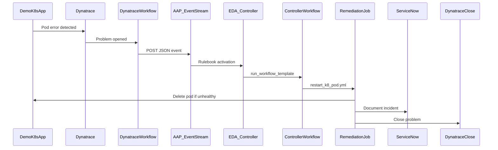

# Event-Driven Ansible: Dynatrace → Pod Restart → ServiceNow

Demo repository for **Event-Driven Ansible (EDA)** on Ansible Automation Platform 2.6+: Dynatrace detects an unhealthy Kubernetes pod, sends an event through an **Event Stream**, EDA launches an **Automation Controller workflow** that deletes the pod so the workload controller recreates it, updates **ServiceNow**, and **closes the Dynatrace problem**.

## Architecture




## Prerequisites

- Ansible Automation Platform **2.6+** with EDA and Event Streams
- Dynatrace with **Workflows** and [Red Hat Ansible for Workflows](https://docs.dynatrace.com/docs/analyze-explore-automate/workflows/default-workflow-actions/actions/red-hat/redhat-even-driven-ansible)
- Kubernetes cluster and credentials for pod delete
- ServiceNow instance and credentials for incident updates
- Dynatrace API token with `problems.write` for closing problems after remediation — Classic **Personal access token**, not a platform token ([docs/create-credentials.md](docs/create-credentials.md))


## Repository layout


| Path                                                                                       | Description                                                            |
| ------------------------------------------------------------------------------------------ | ---------------------------------------------------------------------- |
| `[rulebooks/k8s_cluster_remediation.yml](rulebooks/k8s_cluster_remediation.yml)`           | EDA rulebook → `run_workflow_template` on Controller                   |
| `[playbooks/save_workflow_stats.yml](playbooks/save_workflow_stats.yml)`                   | Normalize EDA payload and publish workflow facts                       |
| `[playbooks/restart_k8_pod.yml](playbooks/restart_k8_pod.yml)`                             | Delete unhealthy pod and wait for workload                             |
| `[playbooks/document_servicenow_incident.yml](playbooks/document_servicenow_incident.yml)` | Set ServiceNow incident to In Progress with work notes                 |
| `[playbooks/close_dynatrace_problem.yml](playbooks/close_dynatrace_problem.yml)`           | Close Dynatrace problem via Problems API v2 after remediation          |
| `[playbooks/close_servicenow_incident.yml](playbooks/close_servicenow_incident.yml)`       | Close ServiceNow incident (optional workflow step)                     |
| `[docs/aap-controller-workflow.md](docs/aap-controller-workflow.md)`                       | Job template + workflow job template setup                             |
| `[k8s/](k8s/)`                                                                             | Sample `load-test-app` Pod, Service, and Route in `ia-lab`             |
| `[dynatrace/](dynatrace/)`                                                                 | Dynatrace demo checklist: Operator, DynaKube, license, EDA Event data  |
| `[inventory/openshift_k8s_inventory.py](inventory/openshift_k8s_inventory.py)`             | Dynamic pod inventory script (kubernetes.core 6.x compatible)          |
| `[k8s/rbac/openshift_aap_sa.yaml](k8s/rbac/openshift_aap_sa.yaml)`                         | ServiceAccount + ClusterRole for AAP OpenShift inventory               |
| `[docs/aap-openshift-inventory.md](docs/aap-openshift-inventory.md)`                       | OpenShift inventory credential and sync                                |
| `[samples/](samples/)`                                                                     | Example event JSON and curl test script                                |
| `[docs/](docs/)`                                                                           | AAP, Dynatrace, and ServiceNow setup guides                            |
| `[docs/build-decision-environment.md](docs/build-decision-environment.md)`                 | Build/push EE image (`linux/amd64`, OpenShift-friendly `/runner` HOME) |
| `[scripts/build-ee.sh](scripts/build-ee.sh)`                                               | Build + verify EE image (`linux/amd64`)                                |
| `[scripts/verify-ee.sh](scripts/verify-ee.sh)`                                             | Pre-push checks (HOME, ansible.eda, galaxy)                            |
| `[execution-environment.yml](execution-environment.yml)`                                   | ansible-builder definition (EDA + Controller)                          |
| `[collections/requirements.yml](collections/requirements.yml)`                             | Ansible collections                                                    |


## Event payload contract

Dynatrace workflow **Event data** must be JSON like `[dynatrace/eda-event-data.json](dynatrace/eda-event-data.json)` (same shape as `[samples/dynatrace_eda_event.json](samples/dynatrace_eda_event.json)`):


| Field                | Required    | Description                                                                                                                                                       |
| -------------------- | ----------- | ----------------------------------------------------------------------------------------------------------------------------------------------------------------- |
| `eventType`          | yes         | Must be `K8S_POD_REMEDIATION`                                                                                                                                     |
| `namespace`          | yes         | Kubernetes namespace                                                                                                                                              |
| `pod_name`           | yes         | Pod to delete if unhealthy                                                                                                                                        |
| `incident_number`    | yes         | ServiceNow `INC…` to close                                                                                                                                        |
| `problem_id`         | recommended | Dynatrace **API problemId** for the close step (use `{{ event()[\"event.id\"] }}` in the Dynatrace workflow — not the display ID `P-…`). Empty value skips close. |
| `severity`           | no          | Optional filter / logging                                                                                                                                         |
| `pod_label_selector` | no          | Wait for ready pods (default `app=demo-app`)                                                                                                                      |


## Create credentials in AAP

The ServiceNow and Dynatrace playbooks read credentials from **environment variables** injected by Automation Controller job templates. Create one credential per integration, then attach each credential to the matching job template(s).

Here how to create the credential `[docs/create-credentials.md](docs/create-credentials.md)`

## Quick start (demo script)

1. Have the demo app deploy (`k8s/`)
2. **Dynatrace portion** — [dynatrace/README.md](dynatrace/README.md) (Operator, DynaKube, HTTP 5xx custom alert, **External requests** for ServiceNow + AAP, import [ia-lab-aap-events.workflow-template.yaml](dynatrace/ia-lab-aap-events.workflow-template.yaml))
3. **Configure AAP** — [docs/aap-setup.md](docs/aap-setup.md) (event stream, EDA activation), [docs/aap-openshift-inventory.md](docs/aap-openshift-inventory.md) (OpenShift SA + inventory), and [docs/aap-controller-workflow.md](docs/aap-controller-workflow.md) (Controller workflow + job template)
4. Map the Event Stream connection when importing the Dynatrace workflow; curl tests use [dynatrace/eda-event-data.json](dynatrace/eda-event-data.json)
5. **ServiceNow and Dynatrace credentials** created in AAP. [docs/create-credentials.md](docs/create-credentials.md)
6. **Generate HTTP 5xx** on `load-test-app` (keep a loop running) and confirm Dynatrace fires **IA-Lab - AAP Events**
7. **Verify:** EDA rule audit, Controller workflow `remediate_k8s_cluster` success, new healthy pod, ServiceNow INC updated, Dynatrace problem closed (HTTP **204** from the close API is success)


### Test without Dynatrace

```bash
export EVENT_STREAM_URL="https://<aap>/eda-event-streams/api/eda/v1/external_event_stream/<uuid>/post"
export EVENT_STREAM_TOKEN="<token>"
export POD_NAME="<failing-pod>"
export INCIDENT_NUMBER="INC0000001"
chmod +x samples/curl_post_event.sh
./samples/curl_post_event.sh
```


## Collections

```bash
ansible-galaxy collection install -r collections/requirements.yml
```

- `ansible.eda` — rulebook / EDA
- `kubernetes.core` — pod operations
- `servicenow.itsm` — incident updates
- `ansible.builtin.uri` — Dynatrace Problems API (no extra collection)


## References

- [Dynatrace → Red Hat EDA (Event Streams)](https://docs.dynatrace.com/docs/analyze-explore-automate/workflows/default-workflow-actions/actions/red-hat/redhat-even-driven-ansible)
- [AAP simplified event routing](https://docs.redhat.com/en/documentation/red_hat_ansible_automation_platform/2.5/html/using_automation_decisions/simplified-event-routing)
- [kubernetes.core.k8s](https://docs.ansible.com/ansible/latest/collections/kubernetes/core/k8s_module.html)
- [Dynatrace Problems API v2 — close problem](https://docs.dynatrace.com/docs/dynatrace-api/environment-api/problems-v2/problems/post-close)


## License

Use and adapt for demos and learning. No warranty implied.