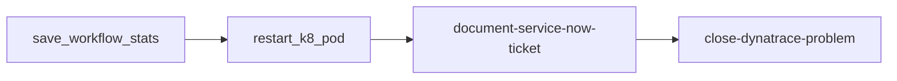

# Automation Controller workflow

EDA receives Dynatrace events and launches a **Workflow Job Template** on Automation Controller. The workflow runs the remediation playbook with credentials, inventory, and execution environment managed by Controller—not by the EDA decision environment.

## Flow

```text
Dynatrace Workflow → AAP Event Stream → EDA rulebook
    → run_workflow_template → Workflow Job Template (remediate_k8s_cluster)
        → save_workflow_stats → restart_k8_pod → document_servicenow_incident → close_dynatrace_problem
```




## 1. Controller project

1. **Automation Controller** → **Projects** → **Create**.
2. Source: same Git repo as the EDA project.
3. **Playbook directory:** leave default (repo root).
4. Sync and confirm `playbooks/remediate_k8s_pod.yml` is present.


## 2. Execution environment (Controller)

Build or select an EE that includes:

- `kubernetes.core`
- `servicenow.itsm`

See `[collections/requirements.yml](../collections/requirements.yml)` and [build-decision-environment.md](build-decision-environment.md) (build from `[execution-environment.yml](../execution-environment.yml)`).

:exclamation: You can also use this [quay.io/froberge/eda-dynatrace-demo-ee:latest](podman pull quay.io/froberge/eda-dynatrace-demo-ee)

## 3. Inventory and credential


### OpenShift API access (recommended)

Create a ServiceAccount on the cluster and an AAP Bearer token credential. Full steps: **[aap-openshift-inventory.md](aap-openshift-inventory.md)**.

```bash
oc apply -f k8s/rbac/openshift_aap_sa.yaml
oc create token aap-inventory -n aap --duration=8760h
```

Use that token in an **OpenShift or Kubernetes API Bearer Token** credential in Controller, then:

1. **(Optional)** Inventory `OpenShift Demo` → source **Sourced from a Project** → `inventory/openshift_k8s_inventory.py` — see [aap-openshift-inventory.md](aap-openshift-inventory.md). Do **not** use **OpenShift Virtualization** (VMs only).
2. Attach the **same credential** to job template `EDA - Remediate K8s Pod` (required).

The remediation playbook runs on `localhost` and calls the API via `kubernetes.core`. Dynamic inventory is for cluster assessment; EDA remediation does not require inventory sync.

### Controller objects


| Object                                | Settings                                                                                                                                            |
| ------------------------------------- | --------------------------------------------------------------------------------------------------------------------------------------------------- |
| **Inventory (remediation / EDA)**     | `EDA Localhost` — single host `localhost`                                                                                                           |
| **Inventory (optional assessment)**   | `OpenShift Demo` — **Sourced from a Project**, file `inventory/openshift_k8s_inventory.py`                                                          |
| **Credential (OpenShift/Kubernetes)** | Bearer token from `aap-inventory` ServiceAccount — inventory source (if used) + job template                                                        |
| **Credential (ServiceNow)**           | ServiceNow or custom type — attach to job template, or use `SN_`* injected via credential                                                           |
| **Credential (Dynatrace)**            | Custom type injecting `DYNATRACE_ENV_URL` and `DYNATRACE_API_TOKEN` (token needs `problems.write`) — attach to close-dynatrace-problem job template |


## 4. Job templates

Each workflow node is a separate job template. Enable **Prompt on launch → Extra Variables** on every template in the workflow (required for EDA `run_workflow_template` and workflow `set_stats`).

### save_workflow_stats


| Field     | Value                                    |
| --------- | ---------------------------------------- |
| Playbook  | `playbooks/save_workflow_stats.yml`      |
| Inventory | `EDA Localhost` (or localhost inventory) |


Normalizes EDA event data and publishes workflow facts (`namespace`, `pod_name`, `sn_incident_number`, `dynatrace_problem_id`).

### restart_k8_pod.yml


| Field                 | Value                                                   |
| --------------------- | ------------------------------------------------------- |
| Playbook              | `playbooks/restart_k8_pod.yml`                          |
| Inventory             | OpenShift/K8s inventory or `EDA Localhost`              |
| Credentials           | **OpenShift or Kubernetes API Bearer Token** (required) |
| Execution environment | Controller EE with `kubernetes.core`                    |


### document-service-now-ticket


| Field       | Value                                                                                       |
| ----------- | ------------------------------------------------------------------------------------------- |
| Playbook    | `playbooks/document_servicenow_incident.yml`                                                |
| Inventory   | `EDA Localhost`                                                                             |
| Credentials | ServiceNow credential (`SERVICENOW_INSTANCE`, `SERVICENOW_USERNAME`, `SERVICENOW_PASSWORD`) |


Sets the ServiceNow incident to **In Progress** and adds work notes.

### close-dynatrace-problem


| Field                                  | Value                                                                               |
| -------------------------------------- | ----------------------------------------------------------------------------------- |
| Playbook                               | `[playbooks/close_dynatrace_problem.yml](../playbooks/close_dynatrace_problem.yml)` |
| Inventory                              | `EDA Localhost`                                                                     |
| Credentials                            | Custom credential with `DYNATRACE_ENV_URL`, `DYNATRACE_API_TOKEN`                   |
| **Prompt on launch → Extra Variables** | **Enabled**                                                                         |


Closes the Dynatrace problem via [Problems API v2 POST close](https://docs.dynatrace.com/docs/dynatrace-api/environment-api/problems-v2/problems/post-close). Skips safely when `dynatrace_problem_id` is empty.

**Custom credential (Controller):**


| Input field     | Injected env var      | Example                             |
| --------------- | --------------------- | ----------------------------------- |
| Environment URL | `DYNATRACE_ENV_URL`   | `https://abc123.live.dynatrace.com` |
| API token       | `DYNATRACE_API_TOKEN` | Token with `problems.write` scope   |


### Legacy single-job template

**Name:** `EDA - Remediate K8s Pod` (optional; superseded by the multi-step workflow above)


| Field                                  | Value                                                     |
| -------------------------------------- | --------------------------------------------------------- |
| Inventory                              | `EDA Localhost`                                           |
| Project                                | This repository                                           |
| Playbook                               | `playbooks/remediate_k8s_pod.yml`                         |
| Execution environment                  | Controller EE with `kubernetes.core` + `servicenow.itsm`  |
| Credentials                            | **OpenShift or Kubernetes API Bearer Token** (required)   |
| **Prompt on launch → Extra Variables** | **Enabled** (required for EDA `run_workflow_template`)    |
| **Prompt on launch → Credentials**     | **Enabled** if workflow jobs fail with `system:anonymous` |


Optional: add a **Survey** with fields `namespace`, `pod_name`, `incident_number`, `problem_id`, `pod_label_selector` for manual runs. EDA passes the same keys via `job_args.extra_vars`.

## 5. Workflow job template

**Name:** `remediate_k8s_cluster` (must match the rulebook `run_workflow_template` name)

1. **Automation Controller** → **Templates** → **Workflow Templates** → create or edit `remediate_k8s_cluster`.
2. Add nodes in order:
  - `save_workflow_stats`
  - `restart_k8_pod.yml`
  - `document-service-now-ticket`
  - `close-dynatrace-problem`
3. **Prompt on launch → Extra Variables:** **Enabled** on the workflow template and on each job template.
4. Save.

You can extend the workflow later (approval step, ServiceNow close job) without changing the rulebook contract.

## 6. Dynatrace workflow — problem_id in Event data

The close step needs the **API problemId** (not the display ID `P-…` unless your tenant accepts it on the close endpoint). In the Dynatrace **Send event to Event-Driven Ansible** action, set `problem_id` in Event data, for example:

```json
{
  "eventData": {
    "eventType": "K8S_POD_REMEDIATION",
    "namespace": "{{ ... }}",
    "pod_name": "{{ ... }}",
    "incident_number": "{{ ... }}",
    "problem_id": "{{ event()[\"event.id\"] }}"
  }
}
```

Validate the expression against your Davis problem trigger payload in a workflow test run. See `[samples/dynatrace_eda_event.json](../samples/dynatrace_eda_event.json)` for the JSON shape.

## 7. EDA rulebook activation variables

On the rulebook activation, set **Variables** (example from `[vars/aap_controller.yml.example](../vars/aap_controller.yml.example)`):

```yaml
remediation_workflow_job_template: "EDA - Dynatrace K8s Remediation"
controller_organization: "Default"
```

The rulebook references these names in `run_workflow_template`.

Ensure the activation is linked to your **Automation Controller** instance (EDA settings / organization default).

## 8. Extra variables passed from events

EDA sends these to the workflow launch API:


| Variable               | Source                                                                |
| ---------------------- | --------------------------------------------------------------------- |
| `namespace`            | `event.payload.namespace`                                             |
| `pod_name`             | `event.payload.pod_name`                                              |
| `incident_number`      | `event.payload.incident_number`                                       |
| `dynatrace_problem_id` | `set_stats` from `event.payload.eventData.problem_id` (workflow fact) |
| `severity`             | `event.payload.severity`                                              |
| `pod_label_selector`   | `event.payload.pod_label_selector`                                    |


The engine also injects `ansible_eda` (event metadata). **Prompt on launch** for extra variables on the workflow template is required so these values are accepted.

## 9. Verify

1. Run the workflow manually from Controller with survey/extra vars from `[samples/dynatrace_eda_event.json](../samples/dynatrace_eda_event.json)`.
2. POST a test event: `[samples/curl_post_event.sh](../samples/curl_post_event.sh)`.
3. Confirm **Workflow Jobs** shows a successful run, pod restarted, ServiceNow updated, and Dynatrace problem closed (when `problem_id` is set).


## Troubleshooting


| Symptom                                           | Fix                                                                                                                                              |
| ------------------------------------------------- | ------------------------------------------------------------------------------------------------------------------------------------------------ |
| `Variables ansible_eda are not allowed on launch` | Enable **Prompt on launch** for Extra Variables on the **workflow** template                                                                     |
| Workflow runs but extra vars empty                | Enable prompt on launch on the **job** template; check activation variable names                                                                 |
| `run_workflow_template` cannot find template      | `remediation_workflow_job_template` matches workflow name and `controller_organization`                                                          |
| `system:anonymous` / cannot get `/apis`           | Attach **OpenShift or Kubernetes API Bearer Token** to the **job template** (not only inventory); enable credential prompt on workflow if needed |
| K8s Forbidden / RBAC                              | Same credential; SA token and ClusterRole in [aap-openshift-inventory.md](aap-openshift-inventory.md)                                            |
| Inventory sync Forbidden                          | ServiceAccount token and ClusterRole in `k8s/rbac/openshift_aap_sa.yaml`                                                                         |
| Wrong hosts / VM-only inventory                   | Use **Sourced from a Project** + `inventory/openshift_k8s_inventory.py`, not OpenShift Virtualization                                            |
| `k8s inventory plugin has been removed`           | Inventory file must be `.py` script, not YAML `plugin: kubernetes.core.k8s` (EE has kubernetes.core 6.x)                                         |
| Inventory sync OK but job fails                   | Remediation uses **EDA Localhost** + credential on job template, not pod SSH hosts                                                               |
| Dynatrace close skipped                           | `problem_id` empty in Event data — playbook skips; set API problemId in Dynatrace workflow                                                       |
| Dynatrace close 401/403                           | Token missing `problems.write`; check `DYNATRACE_ENV_URL` and credential on job template                                                         |
| Dynatrace close 404                               | Wrong `DYNATRACE_ENV_URL` (use environment API URL without `.apps.`, e.g. `https://<env>.dynatracelabs.com`), wrong `problem_id` format (display ID vs API problemId), or problem already closed |


## References

- [ansible-rulebook: run_workflow_template](https://docs.ansible.com/projects/rulebook/en/latest/actions.html)
- [EDA setup (Event Stream)](aap-setup.md)

