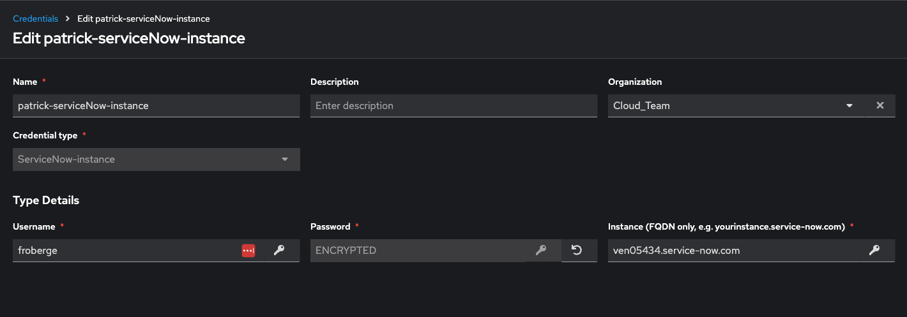
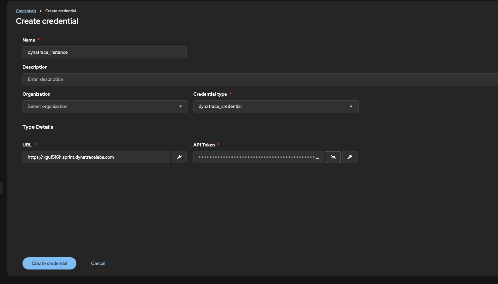

##Configure Ansible Automation Platform Credential for Service Now and Dynatrace


###### ServiceNow Credential

1. In order to be able to call ServiceNow we will have to create a ServiceNow credential Type.

_input configuration
```
fields:
  - id: username
    type: string
    label: Username
  - id: password
    type: string
    label: Password
    secret: true
  - id: instance
    type: string
    label: Instance (FQDN only, e.g. yourinstance.service-now.com)
required:
  - username
  - password
  - instance
```

_injector configuration_
```
env:
  SERVICENOW_INSTANCE: '{{ instance }}'
  SERVICENOW_PASSWORD: '{{ password }}'
  SERVICENOW_USERNAME: '{{ username }}'
```

1. Let's now create the credential.



###### Dynatrace Credential

1. In order to be able to call Dynatrace we will have to create a Dynatrace credential Type.

_input configuration
```
fields:
  - id: url
    type: string
    label: URL
  - id: token
    type: string
    label: API Token
    secret: true
required:
  - url
  - token
```

_injector configuration_
```
env:
  DYNATRACE_ENV_URL: '{{ url }}'
  DYNATRACE_API_TOKEN: '{{ token }}'
```

1. Let's now create the credential.
